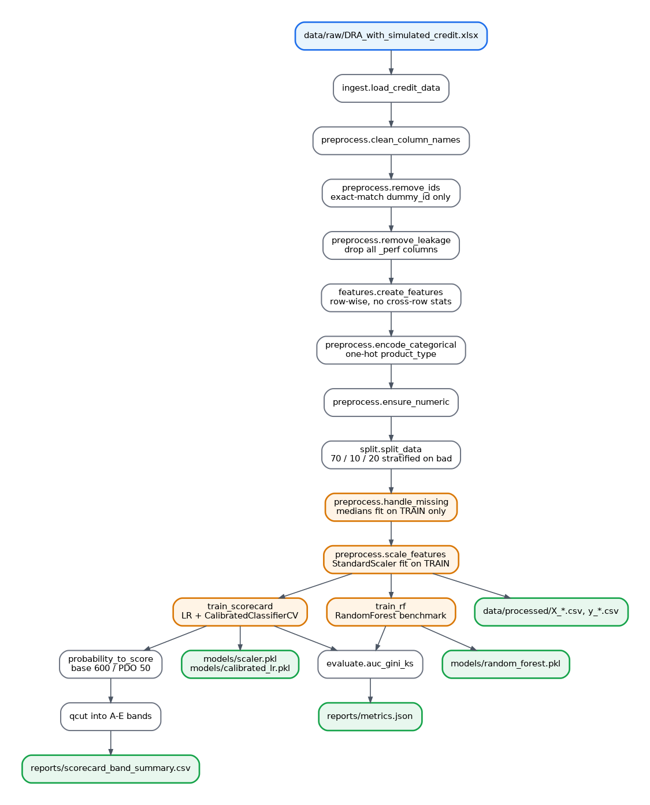
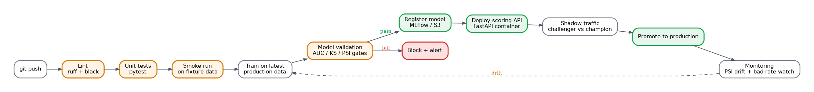

# Machine Learning for Credit Prediction — Phase 3

In the first phase of this project, we demonstrated the value of psychometric data as an alternative input for credit scoring, particularly in thin-file and emerging markets where traditional financial histories are limited or absent. Using the same 13 higher-order DRA factors, we evaluated five different modelling approaches to determine which most effectively ranks credit risk. Our findings showed that while traditional logistic regression provides a stable and highly interpretable baseline, ensemble methods such as XGBoost deliver superior predictive performance by capturing complex non-linear relationships in behavioural data.

Building on these insights, the second phase extended the work by exploring additional Machine Learning techniques, including a hybrid modelling approach. Here, XGBoost predictions were passed through a logistic calibration layer to produce well-calibrated probabilities of default (PD). These probabilities were then transformed into an interpretable scorecard format with risk bands (A–F). This phase highlighted how to effectively balance the strong predictive power of advanced ML models with the operational and regulatory advantages of traditional scorecards delivering both accuracy and explainability in a format that lenders can easily adopt. 

In the third phase, we focus on building a complete end-to-end alternative credit scoring pipeline. This production-oriented system integrates **psychometric (DRA) assessments** with **traditional credit bureau features** to predict loan default probability, calibrate these predictions to a scorecard, and assign A–E risk bands. The project is engineered to be promoted from a local notebook to a CI/CD-driven analytics product with a clean, reproducible path from raw data to scored customer. The ultimate goal is to set up the source environment and production pipeline, with tests, to ensure the code works properly. Finally, SHAP analysis is conducted for traceback and compliance. Various ML techniques, including XGBoost and Random Forests, are used to define and compile features. Final engineered features are included in the logistic regression model, which is calibrated on actual bad rates to estimate the Probability of Default. 

---

## Dataset

This analysis uses real psychometric assessment data. All financial data is simulated to match realistic distributions and patterns from the original dataset (based on a South African thin-file population) containing about 44 998 unique cases to protect any personal data. 

| Property | Value |
|---|---|
| Rows | 44,998 |
| Columns | 58 |
| Target | `bad` (0 = good, 1 = default) |
| Bad rate | 24.2% |
| Source | `data/raw/DRA_with_simulated_credit.xlsx` (simulated) |

The feature space spans four DRA dimension scores, 41 psychometric item-level scales, three composite risk scores (total / drivers / mitigators), three assessment-window credit bureau features, and a product type flag. Three performance-window columns (`num_accounts_perf`, `highest_arrears_perf`, `age_oldest_perf`) contain outcome information and are explicitly stripped as leakage before any modelling.

---

## Pipeline Architecture



**The Critical Design Rule - Preventing Data Leakage** 

A core principle of this pipeline is the strict prevention of data leakage. Every step that learns from the data — such as calculating imputation medians, scaler statistics, model coefficients, or calibration mappings — is performed **only after** the train/validation/test split and is fitted exclusively on the training set.

This discipline ensures that the validation and test data remain completely unseen during any learning process, mirroring exactly how new loan applications would be scored in production. In credit risk modelling, even small leakage — where information that would not be available in real life at the time of prediction influences model training — can dramatically inflate offline performance metrics (e.g., AUC, Gini, KS) while causing the model to underperform or fail in production.

---

## Quick Start

Getting the pipeline up and running is straightforward and designed for reproducibility.

### 1. Clone the repository and set up the environment

```bash
git clone https://github.com/<you>/Machine-Learning-For-Credit-Prediction-Phase-3.git
cd Machine-Learning-For-Credit-Prediction-Phase-3

python -m venv .venv
source .venv/bin/activate   # On Windows: .venv\Scripts\activate
pip install -r requirements.txt
```

### 2. Add the raw data

Place the file `DRA_with_simulated_credit.xlsx` into the `data/raw/` folder. 

This file is deliberately not committed to the repository to protect privacy. Without it, the pipeline cannot run. 

### 3. Run the pipeline

You have two main options: 

**Preprocessing only** (useful for inspecting cleaned data and splits):

```bash
# (a) Preprocess only 
python -m src.data.preprocess
```
This generates processed datasets in data/processed/ and saves the fitted scaler in models/scaler.pkl. 

**Full end-to-end pipeline** (recommended):

```bash
# (b) Full pipeline — scorecard + random-forest benchmark
python -m pipelines.run_pipeline
```
This runs preprocessing and trains the calibrated logistic regression scorecard (with A–E risk bands) and the Random Forest benchmark. It also produces evaluation metrics and band summaries in the reports/ folder.

Always run these commands from the project root directory so that the src.* and pipelines.* imports resolve correctly.

---

## Expected Output

After successfully running the full pipeline, the following output is produced:

| Location | Artefact | Description |
|---|---|---|
| `data/processed/` | `X_train.csv`, `X_val.csv`, `X_test.csv`, `y_*.csv` | Post-split, post-impute, post-scale feature matrices |
| `models/` | `scaler.pkl` | `StandardScaler` fit on training data |
| `reports/` | `metrics.json` | AUC / Gini / KS for the scorecard and the RF benchmark |
| `reports/` | `scorecard_band_summary.csv` | Band count, avg score, avg PD, bad rate per A–E band |

A healthy run looks like this (approximate ranges on a ~24% bad-rate dataset after leakage removal):

| Model | AUC | Gini | KS |
|---|---|---|---|
| Calibrated Scorecard | 0.68 – 0.78 | 0.36 – 0.56 | 0.25 – 0.40 |
| Random Forest benchmark | 1–3 points above the scorecard | | |

The score bands should be **monotonically increasing in bad rate from A → E**. A non-monotonic band table is a signal that calibration or feature selection needs attention.

Single-feature AUCs printed by the leakage diagnostic should all fall in roughly `[0.45, 0.75]`. Anything above 0.90 is a red flag.

---

## Project Structure

The pipeline follows a structured, leakage-proof workflow specifically designed for credit risk applications where interpretability and regulatory acceptance are as important as predictive power.

```
Machine-Learning-For-Credit-Prediction-Phase-3/
├── .github/
│   └── workflows/
│       └── ci.yml                 # Lint, test, and smoke-run on every push
├── src/
│   ├── config.py                  # Single source of truth — target, IDs, leakage, feature groups
│   ├── paths.py                   # Anchored path resolution
│   ├── data/
│   │   ├── ingest.py              # Raw Excel → DataFrame
│   │   ├── preprocess.py          # Clean → drop IDs → drop leakage → split → impute → scale
│   │   └── split.py               # Stratified 70/10/20 split
│   ├── features/
│   │   └── features.py            # Row-wise engineered features
│   └── models/
│       ├── train_scorecard.py     # Calibrated logistic scorecard + A–E bands
│       ├── train_rf.py            # Random forest benchmark
│       ├── evaluate.py            # AUC / Gini / KS
│       └── compare_models.py      # Side-by-side model comparison
├── pipelines/
│   ├── run_pipeline.py            # End-to-end orchestrator
│   └── test_ingest.py             # Smoke test for the ingest layer
├── tests/                         # Unit tests (to be populated)
├── data/
│   ├── raw/                       # .gitignored — raw Excel lives here
│   └── processed/                 # .gitignored — generated CSVs
├── models/                        # .gitignored — pickled scaler + models
├── reports/                       # .gitignored — metrics & band summaries
├── archive/
│   ├── v1_initial/                # Earlier parallel build, kept for comparison
│   └── v2_refactor/               # Earlier refactor, kept for diff / audit trail
├── README.md
├── requirements.txt
└── .gitignore
```

---

## Configuration

Everything the pipeline cares about lives in [`src/config.py`](src/config.py):

- `TARGET` — the label column (`bad`)
- `ID_COLUMNS` — exact-match identifier columns to strip (`dummy_id`)
- `LEAKAGE_COLUMNS` — performance-window columns that must never reach the model
- `BASE_FEATURES` — typed feature groups (DRA dimensions, DRA items, risk composites, credit bureau, categorical)
- `RANDOM_STATE`, `TEST_SIZE`, `CALIBRATION_METHOD`

No magic strings are scattered across the code — adding a feature, changing the target, or adjusting the leakage list is a one-file change.

---

## Testing

```bash
pytest -q
```

The test suite should cover, at minimum:

- **Ingest** — file exists, expected shape, expected columns
- **Column cleaning** — idempotent, known ID column dropped, legitimate `*_assess` features preserved
- **Leakage** — every `*_perf` column removed; assertion fails if any remains
- **Split** — stratification preserves the bad rate within ±1 percentage point across train / val / test
- **Fit-on-train discipline** — imputation medians and scaler statistics are identical when the pipeline is re-run with the same seed
- **Metrics sanity** — scorecard AUC > 0.60 and < 0.95 on the test set (lower bound = model works, upper bound = no leakage)

---

## Production Roadmap — CI/CD

This repository is structured so the path from a commit to a deployed model is mechanical, not heroic. The stages below describe the full CI/CD pipeline the project targets. The file [`.github/workflows/ci.yml`](.github/workflows/ci.yml) already implements the first three stages today.



### Stage 1 — Continuous Integration (Implemented) 

Every push to `main` or `develop`, and every pull request, runs linting (Ruff), formatting checks (Black), unit tests (pytest), and a smoke-run. This configuration represents the foundation of a production-ready machine learning pipeline and ensures code quality, consistency, and reproducibility from day one.

**1. Lint & Test:** 
- Linting with Ruff: Checks for common coding issues, unused imports, undefined variables, and potential bugs.
- Formatting with Black: Enforces a consistent code style across all Python files in `src/` and `pipelines/`.
- Unit Tests with pytest: Runs automated tests to verify that individual components (preprocessing, splitting, etc.) work as expected.

The tests run on three different Python versions simultaneously. This gives confidence that the pipeline will behave consistently whether someone runs it on Python 3.10, 3.11, or 3.12. 

**2. Smoke Run (End-to-End Pipeline Test):** 

After the linting and unit tests pass, a smoke test runs the entire pipeline from start to finish using a small generated dataset. This smoke test is extremely useful because it catches integration issues early. No merge to `main` is allowed without a green build.

### Stage 2 — Continuous Training

A scheduled workflow (daily or weekly) re-runs the full pipeline on the latest production data snapshot and writes metrics to a tracking store. This requires only minor extensions to the existing `ci.yml` plus secure handling of production data.

### Stage 3 — Model Validation Gate

Before registration, every new model must pass hard gates: AUC and KS above defined floors, Population Stability Index (PSI) below a ceiling versus the champion model, and strict monotonicity in the A–E risk bands.

### Stage 4 — Model Registry

Passing models are versioned with a git SHA, data hash, and full metrics. The scoring service always consumes artefacts from the registry — never a `.pkl` file from a developer's laptop.

### Stage 5 — Scoring Service

A FastAPI container loads the registered model and exposes a `/score` endpoint. It returns PD, final score, and risk band. The container is built and pushed by CI on every tagged release.

### Stage 6 — Shadow Traffic 

New models run in parallel with the champion on live traffic. Predictions are logged for comparison, but customer decisions still use the current champion.

### Stage 7 — Promotion 

After the shadow period, a human review compares challenger vs champion metrics. Promotion simply updates a pointer in the model registry — no code changes or service restarts are required.

### Stage 8 — Monitoring

Ongoing tracking of population stability, feature drift, realised bad rate vs predicted PD, and A–E band stability. Significant drift automatically triggers Stage 2 (retraining). 

This is the skeleton that customers and regulators are buying: not just one good model, but a **repeatable, auditable system** that can train, validate, deploy, monitor and and retire models on a schedule — while maintaining the interpretability and compliance needs of credit risk scoring. 

By building strong foundations (leakage-proof pipeline + CI/CD), we make the journey to full production deployment straightforward and low-risk.

---

## What Gets Committed to Git

**In the repo:**

- `src/`, `pipelines/`, `tests/` — all source
- `.github/workflows/` — CI configuration
- `README.md`, `requirements.txt`, `.gitignore`
- `archive/` — historical builds kept for the audit trail

**Never in the repo (enforced by `.gitignore`):**

- `data/raw/*` — raw Excel stays in object storage, not git
- `data/processed/*` — generated outputs
- `models/*.pkl` — binary artefacts belong in a model registry
- `__pycache__/`, `.venv/`, `.env`, `.DS_Store`
- `reports/*.csv`, `reports/*.json` — generated metrics

Raw data and model binaries in git are the single fastest way to make a repository unclonable and a team unhappy.

---

## References 

Keating, L. (2021). Automated Feature Engineering in Ensemble Credit Scoring Pipelines. 

Roland, A. (2025). Machine learning for credit scoring and loan default prediction using behavioral and transactional financial data. World Journal of Advanced Research and Reviews, 26(3), 884-904. https://doi.org/10.30574/wjarr.2025.26.3.2266 

## License

TBD — add your chosen license file before the repository becomes public.
