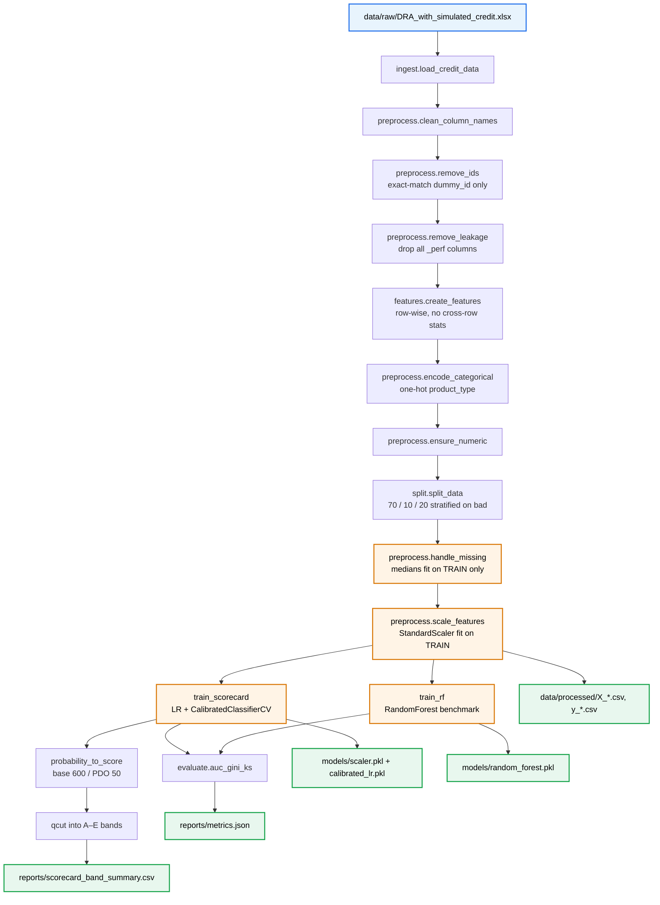
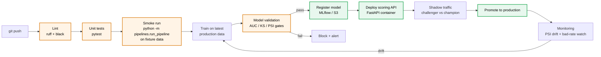

# Machine Learning for Credit Prediction — Phase 3

A production-oriented credit scoring pipeline that combines **psychometric (DRA) assessments** with **traditional credit bureau features** to predict loan default probability, calibrate it to a scorecard, and assign A–E risk bands. This data is simulated from original dataset containing about 44 998 unique cases to protect any personal data. 

The project is engineered to be promoted from a local notebook to a CI/CD-driven analytics product with a clean, reproducible path from raw data to scored customer. The ultimate goals is to set up source environment and production pipeline with test to make sure code works properly. 

---

## Dataset

| Property | Value |
|---|---|
| Rows | 44,998 |
| Columns | 58 |
| Target | `bad` (0 = good, 1 = default) |
| Bad rate | 24.2% |
| Source | `data/raw/DRA_with_simulated_credit.xlsx` (simulated) |

The feature space spans four DRA dimension scores, 41 psychometric item-level scales, three composite risk scores (total / drivers / mitigators), three assessment-window credit bureau features, and a product type flag. Three performance-window columns (`num_accounts_perf`, `highest_arrears_perf`, `age_oldest_perf`) contain outcome information and are explicitly stripped as leakage before any modelling.

---

## Pipeline Architecture



**The critical design rule:** every step that learns from the data — imputation medians, scaler statistics, model fitting, calibration — happens **after** the train / validation / test split and is fit on the training slice only. This prevents the subtle information leakage that inflates offline metrics and then destroys a model in production.

---

## Quick Start

### 1. Set up the environment

```bash
git clone https://github.com/<you>/Machine-Learning-For-Credit-Prediction-Phase-3.git
cd Machine-Learning-For-Credit-Prediction-Phase-3

python -m venv .venv
source .venv/bin/activate   # Windows: .venv\Scripts\activate
pip install -r requirements.txt
```

### 2. Place the raw data

Drop `DRA_with_simulated_credit.xlsx` into `data/raw/`. The file is deliberately **not** checked into the repository.

### 3. Run the pipeline

```bash
# (a) Preprocess only — writes data/processed/*.csv and models/scaler.pkl
python -m src.data.preprocess

# (b) Full pipeline — scorecard + random-forest benchmark
python -m pipelines.run_pipeline
```

Both commands must be run from the project root so the `src.*` imports resolve.

---

## Expected Output

Running the full pipeline produces:

| Location | Artefact | Description |
|---|---|---|
| `data/processed/` | `X_train.csv`, `X_val.csv`, `X_test.csv`, `y_*.csv` | Post-split, post-impute, post-scale feature matrices |
| `models/` | `scaler.pkl` | `StandardScaler` fit on training data |
| `reports/` | `metrics.json` | AUC / Gini / KS for the scorecard and the RF benchmark |
| `reports/` | `scorecard_band_summary.csv` | Band count, avg score, avg PD, bad rate per A–E band |

A healthy run looks like this (approximate ranges on a ~24% bad-rate dataset after leakage removal):

| Model | AUC | Gini | KS |
|---|---|---|---|
| Calibrated Scorecard | 0.68 – 0.78 | 0.36 – 0.56 | 0.25 – 0.40 |
| Random Forest benchmark | 1–3 points above the scorecard | | |

The score bands should be **monotonically increasing in bad rate from A → E**. A non-monotonic band table is a signal that calibration or feature selection needs attention.

Single-feature AUCs printed by the leakage diagnostic should all fall in roughly `[0.45, 0.75]`. Anything above 0.90 is a red flag.

---

## Project Structure

```
Machine-Learning-For-Credit-Prediction-Phase-3/
├── .github/
│   └── workflows/
│       └── ci.yml                 # Lint, test, and smoke-run on every push
├── src/
│   ├── config.py                  # Single source of truth — target, IDs, leakage, feature groups
│   ├── paths.py                   # Anchored path resolution
│   ├── data/
│   │   ├── ingest.py              # Raw Excel → DataFrame
│   │   ├── preprocess.py          # Clean → drop IDs → drop leakage → split → impute → scale
│   │   └── split.py               # Stratified 70/10/20 split
│   ├── features/
│   │   └── features.py            # Row-wise engineered features
│   └── models/
│       ├── train_scorecard.py     # Calibrated logistic scorecard + A–E bands
│       ├── train_rf.py            # Random forest benchmark
│       ├── evaluate.py            # AUC / Gini / KS
│       └── compare_models.py      # Side-by-side model comparison
├── pipelines/
│   ├── run_pipeline.py            # End-to-end orchestrator
│   └── test_ingest.py             # Smoke test for the ingest layer
├── tests/                         # Unit tests (to be populated)
├── data/
│   ├── raw/                       # .gitignored — raw Excel lives here
│   └── processed/                 # .gitignored — generated CSVs
├── models/                        # .gitignored — pickled scaler + models
├── reports/                       # .gitignored — metrics & band summaries
├── archive/
│   ├── v1_initial/                # Earlier parallel build, kept for comparison
│   └── v2_refactor/               # Earlier refactor, kept for diff / audit trail
├── README.md
├── requirements.txt
└── .gitignore
```

---

## Configuration

Everything the pipeline cares about lives in [`src/config.py`](src/config.py):

- `TARGET` — the label column (`bad`)
- `ID_COLUMNS` — exact-match identifier columns to strip (`dummy_id`)
- `LEAKAGE_COLUMNS` — performance-window columns that must never reach the model
- `BASE_FEATURES` — typed feature groups (DRA dimensions, DRA items, risk composites, credit bureau, categorical)
- `RANDOM_STATE`, `TEST_SIZE`, `CALIBRATION_METHOD`

No magic strings are scattered across the code — adding a feature, changing the target, or adjusting the leakage list is a one-file change.

---

## Testing

```bash
pytest -q
```

The test suite should cover, at minimum:

- **Ingest** — file exists, expected shape, expected columns
- **Column cleaning** — idempotent, known ID column dropped, legitimate `*_assess` features preserved
- **Leakage** — every `*_perf` column removed; assertion fails if any remains
- **Split** — stratification preserves the bad rate within ±1 percentage point across train / val / test
- **Fit-on-train discipline** — imputation medians and scaler statistics are identical when the pipeline is re-run with the same seed
- **Metrics sanity** — scorecard AUC > 0.60 and < 0.95 on the test set (lower bound = model works, upper bound = no leakage)

---

## Production Roadmap — CI/CD

This repository is structured so the path from a commit to a deployed model is mechanical, not heroic. The stages below describe the CI/CD pipeline the project targets, and [`.github/workflows/ci.yml`](.github/workflows/ci.yml) implements the first three of them today.



**Stage 1 — Continuous Integration (implemented).** Every push runs linting, unit tests, and a smoke-run of the pipeline on a small fixture dataset. No merge to `main` without a green build.

**Stage 2 — Continuous Training.** On a cadence (daily or weekly), a scheduled workflow re-runs the full pipeline on the latest production snapshot and writes metrics to a tracking store. This is cron in `ci.yml` plus an `environment` for production secrets.

**Stage 3 — Model validation gate.** Before a newly trained model can be registered, it must clear hard-coded gates: AUC above a floor, KS above a floor, population stability index (PSI) below a ceiling against the current champion, and no monotonicity violations in the score bands.

**Stage 4 — Model registry.** Passing models are registered with a version, a git SHA, a data hash, and the metrics that earned them promotion. This is the artefact the scoring service consumes — never a `.pkl` pulled from a developer laptop.

**Stage 5 — Scoring service.** A FastAPI container loads the registered model and exposes a `/score` endpoint that takes a customer payload, returns a PD, a score, and a band. The container is built by CI and pushed to a registry on every tag.

**Stage 6 — Shadow traffic.** New models receive live traffic in parallel with the champion. Predictions are logged for both; no customer decision depends on the challenger yet.

**Stage 7 — Promotion.** After the shadow period, a human review of challenger vs champion metrics promotes or rejects. Promotion flips the live pointer in the registry — no code deploy, no service restart.

**Stage 8 — Monitoring.** Population stability, feature drift, realised bad rate vs predicted PD, and A–E band stability are tracked on a rolling window. Drift beyond a threshold triggers Stage 2 for retraining.

This is the skeleton customers are buying: not one good model, but a **repeatable system** that can train, validate, deploy, and retire models on a schedule.

---

## What Gets Committed to Git

**In the repo:**

- `src/`, `pipelines/`, `tests/` — all source
- `.github/workflows/` — CI configuration
- `README.md`, `requirements.txt`, `.gitignore`
- `archive/` — historical builds kept for the audit trail

**Never in the repo (enforced by `.gitignore`):**

- `data/raw/*` — raw Excel stays in object storage, not git
- `data/processed/*` — generated outputs
- `models/*.pkl` — binary artefacts belong in a model registry
- `__pycache__/`, `.venv/`, `.env`, `.DS_Store`
- `reports/*.csv`, `reports/*.json` — generated metrics

Raw data and model binaries in git are the single fastest way to make a repository unclonable and a team unhappy.

---

## License

TBD — add your chosen license file before the repository becomes public.
